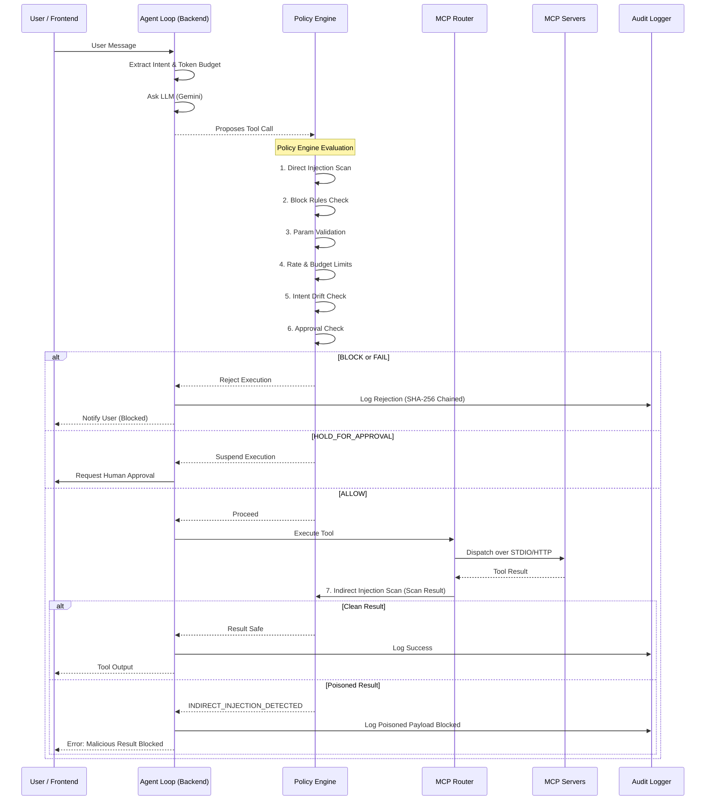

# ARMORIQ: The Agentic Security Policy Engine

ArmorIQ is an advanced runtime policy engine designed to secure AI agents by guarding the action layer. While traditional security models focus on the LLM layer, ArmorIQ mitigates critical agentic threats—such as Agent Goal Hijack, Tool Misuse, Unbounded Consumption, and Scope Creep—by enforcing strict, programmable policies on Model Context Protocol (MCP) tool execution.

This architecture directly addresses the OWASP Agentic Top 10 vulnerabilities, providing a deterministic, fail-closed security posture for autonomous agents.

---

## The Agentic Flow

Every action proposed by the LLM passes through a rigorous, synchronous gauntlet before execution.

---

## Core Components

The ArmorIQ monorepo is divided into three primary functional areas:

### 1. AI Agent (Backend)

The backend is built with Node.js, Express 5, and Socket.io, utilizing strict TypeScript and Zod for validation. It manages the continuous agent loop powered by Gemini 2.5 Flash and evaluates every tool call against the isolated Policy Engine.

**The Policy Engine:**
The heart of ArmorIQ operates entirely independent of the framework, executing eight sequential checks in sub-millisecond latency:
- **Direct Injection Scan:** Scans user arguments for prompt leaking and override keywords.
- **Indirect Injection Scan:** A critical defense layer that scans the result returned by an external tool (e.g., a fetched webpage) before feeding it back into the LLM context to prevent external manipulation.
- **Block Rules:** Rejects matching tool patterns instantly.
- **Validation Rules:** Evaluates parameter constraints using dynamic Zod schemas.
- **Rate Limit & Budget Rules:** Prevents unbounded consumption by tracking tool invocation frequency and LLM token budgets.
- **Intent Drift:** Compares the requested tool against the initially extracted user intent, preventing scope creep.
- **Approval Rules:** Pauses execution to require human-in-the-loop intervention.

**Advanced Backend Capabilities:**
- **Tool Chain Analyzer:** Detects dangerous sequential patterns (e.g., reading a sensitive file immediately followed by sending an email).
- **Risk Scorer:** Dynamically calculates a risk score per conversation based on policy decisions, flagging or terminating sessions that cross acceptable thresholds.
- **Audit Logger:** Maintains a tamper-evident SHA-256 hash chain for all decisions to satisfy strict compliance requirements.

### 2. Policy / Guardrails Dashboard (Frontend)

The frontend is a Next.js 15 (App Router) application utilizing Tailwind CSS, shadcn/ui, and Zustand for highly responsive, optimistic state management. It provides a technical, terminal-inspired interface for security operators.

**Dashboard Features:**
- **Overview (Control Room):** Displays live animated metrics (tool calls, block rates, pending approvals, average risk scores) and an event feed streaming via WebSockets.
- **Chat Interface with Live Tool Trace:** A split-screen layout where operators can interact with the agent while watching a live, step-by-step trace of every tool call, policy decision, latency metric, and risk score adjustment.
- **Policy Rules Manager:** Allows operators to define granular Block, Approve, Validate, Budget, and Rate Limit rules. Rule conflicts are deterministically resolved (e.g., Block overrides Approve) and live-updated across active agent loops without requiring a restart.
- **Approval Queue:** Displays pending tool executions that matched an Approve rule. Includes live countdown timers that auto-deny the request if the operator does not act before the timeout expires.
- **Audit Log & Traceability:** Allows operators to review the hash-chained history of all decisions. Includes a one-click chain integrity verification tool.

### 3. Custom MCP Server (Model Context Protocol)

ArmorIQ heavily leverages the open standard Model Context Protocol (MCP) to decouple LLM capabilities from the core application. 

**The Threat Intel Server:**
ArmorIQ ships with a custom-built, Streamable HTTP MCP server named `threatintel-mcp`. This server provides specialized security capabilities and includes its own internal rate-limiter to protect external API quotas.

Available tools include:
- `check_domain`: Validates domains against VirusTotal threat intelligence.
- `check_ip`: Analyzes IP addresses using AbuseIPDB.
- `lookup_cve`: Fetches vulnerability details from NIST NVD.
- `scan_url`: Submits URLs to UrlScan.io and retrieves execution results.
- `get_threat_summary`: A composite tool that auto-detects the input type and synthesizes a comprehensive threat intel report.

**Dynamic Server Registration:**
Administrators can dynamically register new MCP servers (either STDIO or Remote HTTP) directly from the frontend dashboard. 
- Connecting a new server probes it for available tools.
- Administrators can configure `allowedTools` to expose only a subset of the server's capabilities to the agent.
- Upon registration, the agent loop immediately incorporates the new tools into its function declarations—no restarts required.

---

## Security, Scalability, and Edge Cases

ArmorIQ is hardened for enterprise deployment:
- **Resilience:** If an external MCP server crashes or hangs, the router enforces a strict 10-second timeout. The server is temporarily marked unhealthy, and the agent gracefully informs the user without terminating the loop.
- **Fail-Closed Approvals:** If an operator fails to respond to an approval request within the designated time-to-live (TTL), the system automatically denies the action to ensure safety.
- **Loop Guards:** Tracks consecutive identical tool calls to prevent the LLM from getting stuck in a hallucination loop.
- **Hardened Infrastructure:** Built on Prisma with connection pooling, Helmet for security headers, express-rate-limit for brute-force protection, and Pino for high-performance structured logging.
